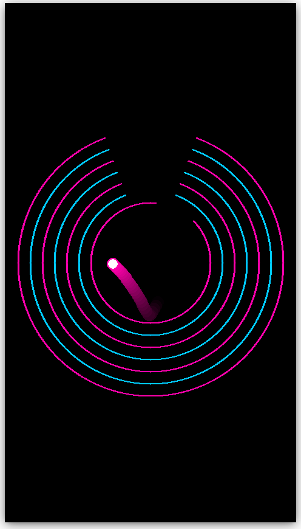

# Brain rot bouncing-ball

Stupid bouncing ball animation in the style of the popular brainrot yt videos.

## Install requirements

`pip install -r requirements.txt`

## Run main example

`cd code/` and `python3 main.py` then press **p** to start the animation.

## Notes

- Might add more examples later, but you can add different sounds touching the `sounds.py` file a bit and use different shapes using the different classes (Triangle, Polygon).

- The codebase is super messy and a lot of things can be made better, but this was coded as a fast fun project to make me stop doom-scrolling YouTube shorts. Anyways, felt like sharing.
 
 